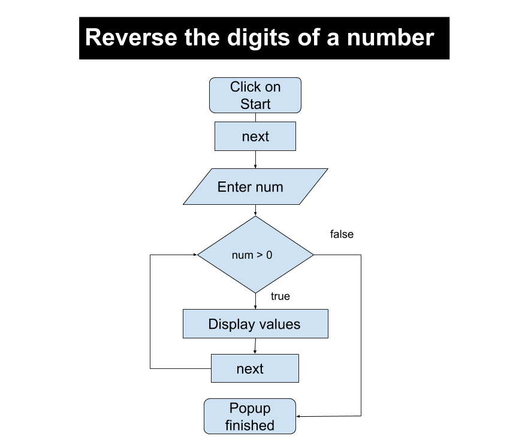
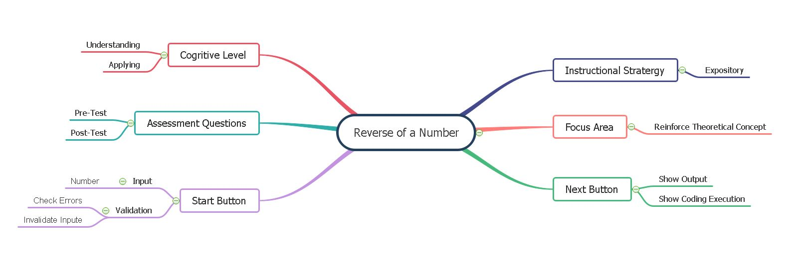

## Storyboard (Round 2)

Experiment 2 : Write a program to reverse a number.

### 1. Story Outline:
To find the reverse of the number "While loop" is used. The reverse of the number is obtained with the help of the remainder and modulo division operator using a while loop.

### 2. Story:

After the simulation starts, the student will see the code. The student will start execution while executing it shows a message to the user about every statement. when scanf statement executes user will input a number.It is stored in variable "num".To reverse the number, while loop is executed in loop to get last digit modulo division the number by 10 i.e. lastDigit = num % 10 will be executed. Then the while loop is used until the number is greater than. In each iteration of the loop, the remainder when the number is divided by 10 is calculated and the value of the number is reduced by 10 times.Inside the loop, the reversed number is computed using:rev = rev*10 + remainder. 

#### 2.1 Set the Visual Stage Description:

The screen is divided into two blocks, one for code execution and other for output Functioning. At the top of the page, there are two buttons named "START" / "NEXT" and "RESET". An input box will appear on the line, where the input statement is written in the code block. The changes are displayed in the execution section.

#### 2.2 Set User Objectives & Goals:
1. To understand application of while loop in program.How while loop executes when condition will be true and false.
2. To apply concept of while loop by reversing number in the program.

#### 2.3 Set the Pathway Activities:
- The simulator will show step by step execution of program for every line of code by displaying comments explaining use of each line. The changing values of variables are shown with every excuted statement in code to get clear understanding of the c program written using while loop.

- As the while loop get excuted simulator shows the excution of while loop when condition is true and how it will excute when it will be false. So it will make student understand application of while loop in the program.The changes in values of variables also shown by highlighting the border of boxes in the simulator.  

##### 2.4 Set Challenges and Questions/Complexity/Variations in Questions:

NA

##### 2.5 Allow pitfalls:
This pitfall does not mean wrong answer and retrying. It is designed to clear misconceptions or incorrect knowledge.Pitfalls are used to check the attention of program by the student.If the student kept input blank or entered input greater than 10 digits, it will display message invalid input and try again.

##### 2.6 Conclusion:
The simulation will make student  to understand and predict the behavior of while loops.Student will be able to write valid while loops.They will be able to describe and understand the condition part of while loops.They will get to know flow of execution for while loop.

##### 2.7 Equations/formulas: NA

### 3. Flowchart 
 
 

### 4. Mindmap:

### 5. Storyboard :
Storyboard: <a href="storyboard/storyboard_reverse_num.gif"> HERE </a>

